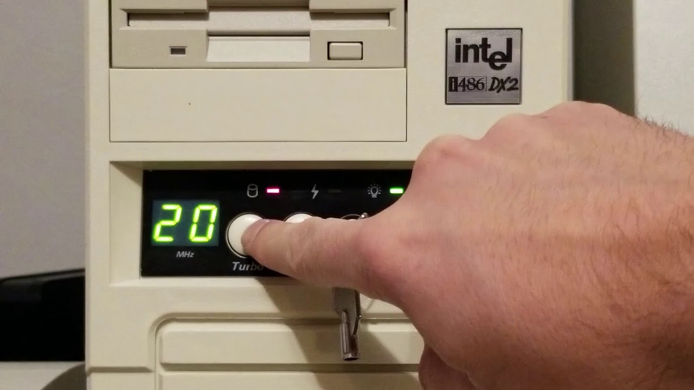

# 💻 **Version Alpha : Genesis**

---

## 📘 **Introduction : Alpha 0.0.1 – Le Déclencheur**

### 📝 **Pour les non-initiés**
Ce document inclut des termes techniques spécifiques au développement et au monde geek. Pour ceux qui ne sont pas familiers avec ces termes, il suffit de **passer la souris** sur les mots en question pour voir une courte description. Pas besoin de s'interrompre dans la lecture : les définitions sont discrètes et se révèlent seulement en survolant les mots.

---

### 🌅 **Réveil Inspirant**
Ce matin, en ouvrant les yeux ☀️, j'ai ressenti une envie soudaine de faire le point, de replonger dans mon parcours de développeur 👨‍💻. Le monde du code est devenu mon quotidien, mais revenir aux origines de cette passion semblait plus que nécessaire. Après tout, chaque ligne de code a une histoire, chaque pixel, une mémoire.

### 🎉 **Commencement**
Je me dis alors, pourquoi ne pas revenir *au tout début*, là où tout a commencé ? Pourquoi ne pas partager cette aventure depuis mes premiers instants, comme on débugge un programme en remontant à la source ? Ainsi, cette **Version Alpha** de mon histoire est née, prête à être codée.

### 🖥️ **Outils en main**
Me voilà, assis face à Visual Studio Code, l’éditeur de texte 📄✨, un fond noir avec ses lignes colorées. Un bon café ☕, et les doigts posés sur le clavier ⌨️. Ce sera mon histoire, écrite ligne par ligne, de façon aussi logique que poétique, comme un projet de code personnel, mais… *humain*.

---

### Autres Exemples de Termes en Survol

- **Commit** : Commit
- **Merge** : Merge
- **Frontend** : Frontend
- **Backend** : Backend

## 🌱 **Version Alpha 0.1 – 1982 : L’année des débuts**

> L'année est 1982. Dans les laboratoires d’Intel 🏢, les ingénieurs sont en pleine effervescence autour du futur **processeur i286**. Une petite révolution se prépare pour les systèmes informatiques ! 💾 Mais avant que ce bijou ne fasse son entrée en février, moi, je décide de prendre un peu d’avance…
<!-- 

-->
### 👶 **Un "Processeur" en Mode Test**
En janvier, j’arrive un peu comme un bug dans le système 🐞 : *besoin de câlins, de biberons, mais surtout pas de mémoire étendue !* Si le i286 allait faire sensation en février, moi, j’étais encore en **version bêta**, en test. Ma contribution ? Mes premiers *crash tests* de pleurs et de sommeil intensif 😴.

> 🎨 *À l’image du i286, je fais mon entrée dans le monde, prêt à me déployer, petit à petit, avec une architecture qui ne demande qu’à évoluer.*
<!-- 
 -->

---

## 🌟 **Version Alpha 0.2 – L'ancêtre 8086 : Le premier de la lignée**

Dans le monde des processeurs, il y a des pionniers. Et dans ma lignée, le **8086** était comme le grand-oncle un peu bourru 👴, sans trop de finesse mais efficace. Sorti dans les années 70, il posait les bases : une architecture solide, même si pas de quoi rêver.  
<!-- 

-->
### ⚙️ **Un vieux routier de la tech**
Imaginez un processeur qui avance lentement, mais sûrement. Pas de multitâche, pas de mémoire étendue – juste du basique. Et pendant que le 8086 avançait avec détermination, moi, bébé du début des années 80, je faisais mes premiers essais, apprenant encore à pleurer et à manger. 👶🍶

> 📜 *En quelque sorte, je suis l’héritier de cet ancêtre : moi aussi, j’allais commencer simple avant de viser plus haut.*

---

## 🚀 **Version Alpha 0.3 – L’oublié 80186 : Un parent déjà dépassé**

Arrive ensuite le **80186**, un processeur qui, dès son arrivée, semblait déjà passé de mode. Comme un membre de la famille qu’on évite d’évoquer, il n’a pas marqué l’histoire comme d’autres. Ce **80186** n'a pas su amener de vraies innovations – pas de mode protégé, pas de multitâche.
<!-- 
 -->

### 💤 **Un processeur sans éclat**
Si le 8086 pouvait au moins prétendre être le début d’une révolution, le 80186, lui, n’a fait que passer. C’était un peu comme ce bébé qui ne dort pas bien, qui mange quand il veut : il est là, mais rien d’exceptionnel pour l’instant 😴.

> 🎩 *Chaque lignée a son maillon faible, et le 80186 en fait partie. Heureusement, d'autres versions allaient vite apporter le turbo !*

---
## 🔥 **Version Alpha 0.4 – Le i286 : Une révolution (presque) comme moi**

<!-- 
 -->

En 1982, Intel lance enfin un processeur prêt à tout changer : le **i286**. Ce petit bijou, capable de gérer jusqu’à 16 Mo de mémoire, amène avec lui une innovation majeure, le **mode protégé** 🛡️. C’est le début des véritables protections de système, évitant les plantages et offrant une stabilité incroyable pour l’époque.

### 🛡️ **Le Super-Héros des circuits**
Là où le 8086 faisait le minimum et le 80186 se perdait en route, le **i286** est une vraie étoile. Tout comme moi qui découvre mon petit monde, ce processeur explore ses capacités avec assurance. Pendant que le **i286** fait sensation, moi, je teste mes premiers pas et mes premiers sourires, en mode *bêta*.

> 💾 *Le i286 posait des bases solides, et moi, je commençais à me familiariser avec ce monde, prêt à expérimenter mes premières aventures.*

---

## 🏗️ **Version Alpha 0.5 – Un bond technologique vs. un nouveau-né**

<!-- 

 -->

Le i286 s’installe et devient un incontournable des années 80, marquant les premiers vrais pas vers une informatique plus stable et plus fiable. Pendant ce temps, de mon côté, j’avance aussi, pas à pas, trouvant mon rythme. Ce n’est pas encore le multitâche, mais ça commence à venir ! 😉

### 👣 **Mon Alpha Version**
Tout comme le i286 évolue, je commence moi aussi à interagir un peu plus avec ce qui m’entoure. Pas encore d’écrans et de clavier, mais je capte les sons, les visages, et les voix familières autour de moi. On pourrait dire que j’ajoute mes premières fonctions au programme ! 

> 💡 *Si le i286 se bâtit une réputation, moi, je construis doucement la mienne, prêt à devenir une version plus stable de moi-même avec les années.*

---

## 🌍 **Version Alpha 0.6 – 1985 : L’arrivée du i386 et des premiers pas… loin de chez moi**

.jpg)
<!-- 
 -->

En 1985, Intel lance le **i386**, un processeur qui va véritablement révolutionner l’informatique avec une architecture **32 bits** et un espace d’adressage bien plus grand 🌌. Là où le i286 atteignait ses limites, le i386 ouvre de nouvelles portes : il gère mieux le multitâche et est prêt pour des applications plus complexes. 

### 🌎 **Moi aussi, je change de monde**
Cette année-là, tout comme le i386 s’étend vers de nouveaux horizons, moi aussi je fais mes **premiers pas loin de chez moi**. Mon univers s’agrandit. Né au Brésil, je découvre la Guyenne française, un environnement bien différent, où tout semble plus évolué, un peu comme si le **i386 remplaçait le i286** dans un PC. 🌐

> 🛠️ *Tout autour de moi devient plus structuré. Là où j’étais un simple explorateur, je commence à découvrir un monde aux possibilités infinies.*
# 🏢 **Version Alpha 0.7 – Le i386 : comme un beau-père évolué et bienveillant**
<!-- 

 -->

Si je devais imaginer le **i386** comme une figure humaine, ce serait comme un **beau-père solide et fiable**. Bien plus avancé que ses prédécesseurs, il n’est plus un simple processeur, mais un véritable **pilier pour les systèmes informatiques** de l’époque. 🖥️

### 🤝 **Un soutien bienveillant**
Dans ma vie, cette époque me fait penser à mon beau-père, lui aussi un modèle de stabilité. Avec son entreprise dans le bâtiment, il est comme un i386 de la vie réelle, qui sait construire du solide et veiller sur son environnement. Là où le 80186 n’avait pas laissé d’empreinte durable, le i386 – et mon beau-père – posent des bases pour l’avenir.

> 🌱 *Pour moi, le i386, c’est bien plus qu’un composant : c’est un modèle de force, de patience et d’innovation. Et avec mon beau-père, je commence à comprendre l’importance de bien s’entourer pour bâtir quelque chose de grand.*

---

## 🌍 **Version Alpha 0.8 – Des fondations solides**

<!-- 
 -->

En grandissant et en posant mes premiers pas en Guyenne, j'ai commencé à comprendre ce que signifiait “construire”. 🧱 Mon beau-père, dans son travail, érigait des maisons, des routes, des bâtiments où les gens allaient vivre et travailler. 🏡 Pendant ce temps, le processeur i386 construisait, lui aussi, des bases solides pour l’informatique, permettant aux ordinateurs de gérer des systèmes plus complexes. Tout semblait devenir plus stable et structuré autour de moi, avec une base solide sur laquelle m’appuyer.

Comme le i386 qui posait les fondations d'un monde digital, je posais mes racines dans ce nouvel environnement. Ce chapitre de ma vie était une période de stabilité, où je pouvais observer le monde avec une confiance nouvelle, trouvant un point d’ancrage, une fondation qui me soutenait. 🌳

> 🌐 *En fin de compte, le i386 et moi, chacun à notre manière, posions des fondations : lui, dans les circuits des ordinateurs, préparant un futur connecté, et moi, dans ma vie, en cherchant ma place dans un monde toujours plus vaste et complexe.*

---

## 🏅 **Version Alpha 0.9 – Une étiquette fièrement collée**

<!-- 
 -->

Ah, les années 80… Avec l’arrivée du i386, les fabricants de PC étaient en effervescence. 🖥️ Pour eux, avoir un processeur i386, c’était comme obtenir la distinction suprême en matière de technologie. Ils affichaient leur fierté sans hésitation : un bel autocollant “Intel Inside – i386” collé bien en évidence, tel un sceau de qualité, pour dire au monde entier : "Ici, c’est du sérieux !"

De mon côté, je n’avais pas droit à une étiquette aussi officielle. Mais mon beau-père, en me donnant son propre nom, Hortencio, m’a transmis bien plus qu’une simple suite de lettres. Ce nom, il le portait comme un blason, une véritable fierté. Et en me le confiant, il appuyait fort, comme pour s’assurer que cet “autocollant” invisible s’imprime profondément en moi. 💫

> 💖 *Ce nom n’était pas une étiquette ordinaire, mais un héritage de valeurs, un signe de reconnaissance. En me nommant ainsi, il me promettait son soutien et son amour, tout en me guidant dans ma vie, un peu comme le i386 accompagnait les nouvelles machines dans le monde digital.*

---

## 🌄 **Version Alpha 0.10 – Une étiquette venue de loin**

Alors, même sans être gravé sur un autocollant brillant, le nom “Hortencio” est devenu mon étiquette, mon “Intel Inside” à moi. Ce n’était pas juste un nom, c’était une vraie fierté transmise par mon beau-père. Lui portait ce blaze avec une dignité que personne ne pouvait lui enlever. 🌿 Pour d’autres, avec une vision plus… “basique”, ses origines n’étaient peut-être pas quelque chose à mettre en avant. Après tout, il était d’origine indigène de l’Amazonie. Mais pour lui, cela représentait un patrimoine immense. 🌏

Là où certains voyaient une étiquette “exotique”, lui voyait une lignée, une histoire ancrée dans le respect des anciens, la transmission du savoir, et l’importance de toujours partager avec les siens. En me donnant son nom, il m’offrait bien plus qu’une simple étiquette : il m’invitait dans son univers de valeurs, un monde d’entraide et de dignité. 💫

> 🌱 *Pour lui, être un Hortencio, c’était une mission à honorer, pas juste une signature. Ce nom incarnait les racines profondes de l’Amazonie, les traditions de respect et de partage, et surtout, un engagement à porter cet héritage avec fierté.*

---

## 🚀 **Version Alpha 0.11 – L’arrivée de TatySlash81 : Une étiquette, un turbo intégré**

Avant moi, il y avait TatySlash81, ma sœur née en 1981, bien avant que je ne fasse mon entrée prématurée en 1982. Mon beau-père, en véritable visionnaire, a voulu lui transmettre ce qu’il avait de plus précieux : son nom, Hortencio. Mais pour elle, ce n’était pas juste une simple étiquette ; elle l’a reçue comme un héritage. Elle portait ce nom avec une fierté presque instinctive, comme si elle savait déjà ce qu’il représentait. 💫 Et pour couronner le tout, elle semblait avoir un petit quelque chose en plus, une sorte de “mode turbo” intégré. Là où moi, je tâtonnais, elle fonçait, comme ces premiers ordinateurs avec leur bouton turbo, prêts à doubler de vitesse en un clin d’œil. ⚡

Pour notre beau-père, être un Hortencio, ce n’était pas simplement une question de nom. Lui, avec ses origines indigènes de l’Amazonie, portait fièrement un héritage que certains, plus “basics”, auraient pu voir comme exotique ou étrange. Mais lui savait ce que ça signifiait : des racines solides, une lignée connectée à la nature et aux anciens. 🌿 C’était une culture où le respect, le partage, et la transmission du savoir avaient une importance capitale. Et avec cette étiquette, il nous offrait bien plus qu’un nom de famille. 🛤️

> 💫 *TatySlash81 a reçu cet héritage comme une force qui la propulsait en avant, comme si toutes ces valeurs s’étaient imprimées en elle dès le début, lui donnant une longueur d’avance. Elle absorbait tout, comme un processeur de nouvelle génération, et grandissait avec ce respect des racines et cette fierté de porter le nom de notre beau-père.*

En un sens, elle incarnait cet esprit d’innovation et d’adaptabilité, capable de tirer le meilleur de ses origines et de les faire vivre au quotidien. Alors, même sans autocollant brillant, ce nom “Hortencio” est devenu notre propre étiquette, notre “Intel Inside” à nous. 💖 Et quelque part, cela valait bien plus qu’un simple label : c’était une promesse, un engagement, un héritage que notre beau-père nous avait transmis avec fierté, et que nous étions fiers de porter, chacun à notre manière.
## 🌱 **Version Alpha 0.12 – Des valeurs qui nous propulsent**

Grâce à lui, ce nom **Hortencio** est devenu bien plus qu’un simple mot sur des papiers. C’était une promesse. Comme un processeur amélioré qui passe à la génération suivante, notre beau-père voulait s’assurer que nous, ses enfants, saurions honorer cet héritage. 💡 Pour lui, l’essentiel, ce n’était pas de “porter” un nom, mais de le vivre en appliquant ces valeurs de respect, de partage et de transmission. 🌍

Chaque jour, en regardant ce nom, je me rappelle que c’est une étiquette de cœur, gravée dans mon identité, et je me dis que ça vaut bien plus qu’un “Intel Inside” collé sur une machine. Pour moi et TatySlash81, c’est un héritage qui nous propulse et nous guide, bien plus précieux que n’importe quel bouton turbo. ⚡

> 🌳 *Cet héritage est pour nous comme une racine profonde, une source de force qui nous alimente et nous connecte à notre histoire. Nos valeurs sont notre “Intel Inside”, une marque invisible mais présente à chaque instant, nous rappelant qui nous sommes et d’où nous venons.*

---

## 🎄 **Version Alpha 0.13 – Noël à la mode des années 80 : Sapins, Cadeaux et Blabla**

Ah, les **Noëls des années 80**… Chez nous, c’était tout un festival. Mes parents étaient de véritables artisans de l’esprit de Noël, prêts à transformer la maison en petite fabrique de magie. ✨ Chaque année, ils sortaient l’artillerie lourde : un sapin bien touffu qu’ils décoraient jusqu’à la dernière aiguille, des guirlandes multicolores, des boules scintillantes, et même ce faux flocon de neige qu’on retrouvait partout dans la maison bien après le 25 décembre. 🎅🎁

Les cadeaux ? Cachés à des endroits improbables, évidemment. Mon père prenait sa mission d’agent secret très au sérieux pour planquer les paquets comme si c’était de l’or en barre. 🎩🎄 Pour nous, c’était du pur bonheur. Des matinées de décembre à scruter chaque recoin pour essayer de trouver nos cadeaux, le suspense était à son comble. 🎁

> ❤️ *Noël chez nous, c’était plus qu’une fête : c’était un rituel, une aventure remplie de rires, de surprises, et de souvenirs qui réchauffent le cœur, même des décennies plus tard.*

---

## 🎶 **Version Alpha 0.14 – Ambiance festive et amitiés indéfectibles**

La maison était rarement silencieuse. Mes parents étaient les rois des soirées conviviales, aimant recevoir leurs amis pour de bons repas et des discussions qui s’étiraient souvent jusque tard dans la nuit. C’était l’époque des salons enfumés, des rires bruyants, et des 33 tours de musique qui tournaient sur la platine. 🎶 Ils avaient ce rituel, presque sacré, de se retrouver entre amis, et quand ils n’étaient pas les hôtes, ils étaient les invités. Une joyeuse alternance, qui faisait de chaque semaine une fête, au rythme des retrouvailles. 🍷

Moi, gamin curieux, je circulais entre les conversations d’adultes, captant des mots par-ci, par-là, sans trop comprendre mais avec cette impression fascinante que les grandes personnes savaient des choses que je découvrirais bien un jour. Ce monde-là, fait de rires et de camaraderie, c’était une ambiance rassurante. Une sorte de toile de fond permanente, comme une musique de fond chaleureuse qui me berçait. 🎵

> 🌟 *Ces soirées étaient bien plus que des moments festifs. Elles étaient une leçon de vie sur l’importance de l’amitié, de la convivialité et du partage. Une ambiance qui m’a profondément marqué, laissant en moi une empreinte indélébile de cette époque.*

---

## 🚗 **Version Alpha 0.15 – Le bolide : Une Citroën 2CV et sa boîte de vitesse unique**

Dans le décor de notre vie, il y avait aussi la fameuse **Citroën 2CV**, celle de mon beau-père. Ce n’était pas une simple voiture ; c’était un monument de la famille, un classique indémodable qu’on adorait autant qu’on redoutait. La 2CV, c’était ce genre de véhicule qui démarre avec un peu de patience et beaucoup d’espoir. 🚗 Et cette boîte de vitesse ! Un système totalement hors-norme, presque conçu pour tester votre aptitude à rester calme. Chaque passage de vitesse ressemblait à un petit combat, avec ce levier à tirer, pousser et parfois prier. 🙏

Les trajets avec mon beau-père avaient leur lot de secousses, mais c’était du folklore. Cette voiture symbolisait bien son style à lui : simple, sans chichis, mais toujours avec un petit défi à relever. 💪

> 🔧 *La 2CV, tout comme mon beau-père, représentait la solidité, l’endurance et une touche de caractère. Elle faisait partie de notre quotidien, avec ses imperfections et ses défis, mais surtout avec un charme indéfinissable, qui rendait chaque trajet unique.*

## 🎬 **Version Alpha 0.16 – Une famille dans les coulisses : Ma mère costumière de cinéma**

Ma mère avait, quant à elle, une double vie. Oui, elle était l’assistante dévouée de mon beau-père dans son entreprise, mais elle avait aussi son propre monde : le cinéma. Elle était costumière pour une boîte qui réalisait des films, et ça, c’était du grand art ! 🎨 Elle passait des heures à coudre, à ajuster, à imaginer. Et quand elle rentrait avec des anecdotes des coulisses, c’était comme un film dans le film.

Dans notre foyer, on n’avait peut-être pas de stars hollywoodiennes, mais on avait les costumes, les tissus, et toutes ces histoires fabuleuses de tournages qui semblaient nous ouvrir les portes d’un monde parallèle. ✨ Pour moi, ces histoires de plateaux étaient aussi palpitantes que mystérieuses, comme si elle était la gardienne d’un univers secret. 🔮

---

## 👽 **Version Alpha 0.17 – Le rendez-vous du vendredi soir : la série “V” et les lézards**

Chaque vendredi, c’était la grande tradition : le visionnage de la série “V”, cette saga épique des années 80 où des extraterrestres en combinaison rouge débarquaient pour “pacifier” la Terre, tout en cachant leurs vraies intentions. Mais pour moi, plus question de regarder avec eux ; j’étais officiellement jugé “trop jeune”. Alors, je me réfugiais derrière le canapé, observant à la dérobée, fasciné et terrifié à la fois par ces lézards géants déguisés en humains. 🦎

À chaque épisode, je me cachais un peu plus profondément, mes mains prêtes à couvrir mes yeux dès que ces créatures révélaient leur vrai visage. J’en faisais des cauchemars, mais c’était un rituel que j’adorais malgré tout. Mes parents rigolaient en me disant que je finirais par voir des lézards partout, mais pour moi, ce monde extraterrestre restait une énigme. 👀

> 🌌 *Même si ces lézards me faisaient peur, il y avait dans ce rituel du vendredi soir un côté fascinant. Une sorte de frisson interdit, comme une fenêtre entre-ouverte sur un monde mystérieux, que je pouvais observer en cachette, tapi dans l’ombre du canapé.*

---

## 🕰️ **Version Alpha 0.18 – Une routine… qui allait changer**

Notre vie semblait couler ainsi, rythmée par ces rituels, ces amitiés, ces petits bonheurs. C’était une époque où chaque jour semblait se ressembler, où chaque Noël ramenait ses guirlandes et ses mystères, et où les soirs de série offraient leur lot de frissons derrière le canapé. 🎄📺

Pourtant, dans toute routine, il y a toujours quelque chose qui guette. Un jour, un petit grain de sable vient se glisser dans la mécanique bien huilée, et tout bascule. Ce que nous ignorions alors, c’était que ce petit bonheur des années 80 allait bientôt prendre une tournure différente. Une page allait se tourner, amenant avec elle des changements qu’aucun de nous n’aurait pu anticiper. 🌅

> 🎶 *C’est drôle, les valeurs. Elles vous accompagnent, comme une vieille mélodie, une sorte de “top 10” personnel qui vous revient sans cesse en tête, même si ça fait des années. Mon beau-père, lui, il en avait des valeurs, et il les portait haut. Des valeurs de respect, de loyauté, des principes qu’il répétait comme des refrains. C’était ce qui nous rassurait, ce qui nous faisait dire que, oui, nous étions en sécurité dans cette famille.*

Mais voilà, parfois, la vie vous fait perdre le rythme. Comme un vieux disque 5,3 pouces, les valeurs de mon beau-père se sont rayées, déformées, devenant presque méconnaissables. Ce qu’il aurait dû chérir, il a fini par l’oublier. Et l’erreur est arrivée, inévitable, un “bug” qui a tout fait planter. 💔🖥️

---

## ❌ **Version Alpha 0.20 – L’erreur fatale : la ligne de code que ma mère ne pardonne jamais**

Cette erreur, ce n’était pas la première. Ma mère, avec ses yeux de faucon, avait déjà vu ce “code défectueux” chez mon père biologique. 🦅 Elle avait déjà prévenu : cette ligne de code-là, elle ne la pardonnerait jamais. C’était comme une règle gravée dans la pierre, une loi intangible. Et pourtant, mon beau-père, malgré toute son intégrité, a fini par marcher dans la même direction, oubliant ce que tout le monde savait. Il a franchi la ligne rouge, celle qu’il ne fallait pas dépasser. ⚠️

Pour ma mère, c’était clair : il n’y aurait pas de seconde chance. Pas de rémission. Et voilà que notre vie bien réglée s’est fissurée, emportant avec elle cette stabilité que l’on pensait acquise. 💔💥

> 🛑 *Cette erreur, plus qu’une simple ligne de code, était un point de non-retour. Un bug fatal qui a marqué un tournant dans notre histoire familiale.*

---
## ✈️ **Version Alpha 0.21 – Le grand retour : Un “reboot” au Brésil**

Et voilà, en un claquement de doigts, tout a changé. Finies les soirées entre amis, finis les Noëls partagés, fini le confort de cette routine. Nous nous sommes retrouvés dans un avion, direction le Brésil, pour un “reboot” complet de notre vie. Ma mère, ma sœur, et moi. Trois petits passagers, un peu perdus, retournant vers une terre qui, pour moi, avait des airs de mystère. 🌎

Ce retour au Brésil, c’était comme effacer le disque dur pour repartir à zéro. Tout était à reconstruire, sans les repères que nous avions autrefois. Et pourtant, malgré cette rupture, nous n’étions pas totalement dépouillés. Il nous restait les valeurs, celles-là mêmes que mon beau-père avait un jour portées fièrement, avant de les laisser derrière lui comme des reliques d’un passé lointain. 💾

> 🌱 *Ce “reboot” au Brésil, c’était une nouvelle chance, une page blanche. Mais cette fois, nous écrivions notre propre histoire, guidés par des valeurs solides et la force de recommencer.*

---

## 🌅 **Version Alpha 0.22 – Un nouveau départ, avec un bagage de valeurs**

Pourtant, aussi difficile que ce “reboot” fût, ma mère n’avait rien oublié. Elle tenait à ces valeurs que mon beau-père nous avait léguées, même s’il avait lui-même fini par les trahir. C’était comme un code source essentiel, qu’on ne pouvait tout simplement pas effacer. Ces valeurs étaient ancrées en nous, une sorte de système d’exploitation invisible qui continuait de fonctionner, même après le crash. 💻✨

Elle nous répétait que nous allions réussir. Que ce “reboot” ne serait pas une fin, mais une renaissance. 🌱 Ce n’était pas facile, bien sûr. Chaque jour ressemblait à un nouveau test, un débogage permanent où il fallait réapprendre les bases. Mais pour elle, c’était clair : on allait reconstruire, cette fois-ci sur des fondations solides et intactes. 💪

> 💡 *Ce nouveau départ, c’était bien plus qu’une seconde chance. C’était l’occasion de réécrire notre histoire, ligne par ligne, en prenant soin de garder intactes les valeurs qui nous définissaient.*

---

## 🌍 **Version Alpha 0.23 – Le challenge du “reboot” : un monde à redécouvrir**

La vie au Brésil, c’était un peu comme rebrancher un vieil ordinateur qu’on n’avait pas utilisé depuis des années. Tout était là, mais tout semblait nouveau en même temps. 🌐 Pour moi, chaque rue, chaque visage, chaque mot en portugais me ramenait à une culture que je connaissais à peine, mais qui, quelque part, était aussi la mienne.

Avec ma sœur, nous avancions dans ce nouveau décor. C’était un monde plus bruyant, plus coloré, un peu comme si on avait soudainement poussé le contraste au maximum. 🌞🌈 Les gens parlaient fort, riaient fort, vivaient fort. Et au milieu de ce tourbillon, nous apprenions, petit à petit, à nous adapter, à faire de cet endroit notre nouveau foyer. 🏡

> 🔍 *Ce “reboot”, c’était un défi, une aventure, un passage obligé pour redécouvrir qui nous étions et trouver notre place. Entre les valeurs héritées et les nouvelles expériences, nous bâtissions enfin notre propre identité, dans cette terre vibrante et pleine de promesses.*

---

> 🔥 **Version Beta Disponible !**  
> Découvrez les dernières évolutions du projet et les ajouts récents.  
> **[Cliquez ici pour accéder à la Version Beta 🚀](README.beta.md)**